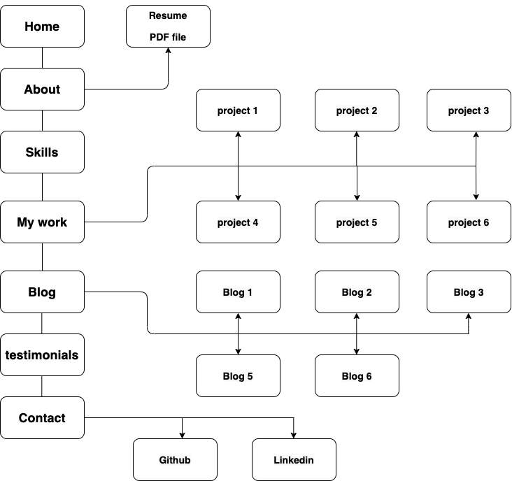

# Kyu's portfolio

## T1A2

A link (URL) to my published portfolio website [kyu's portfolio](https://eunbiggabi.com/)

A link to my Portfolio Ed Workspace
[Portfolio Ed workSpace](https://ait.instructure.com/courses/3482/assignments/38461)

A link to my Github repository [Github repository](https://github.com/eunbiggabi/kyuPortfolio/tree/main)

1. Purpose

 - The portfolio was designed to show potential employers
 - Information about me
 - My skills
 - My projects
 - How to contact me

2. Functionality / features

    A simple webpage with a landing page and links to other pages. All pages will have links to all the other pages. See sitemap below

3. Site map 

    

4. Screenshots

    Screenshots are included throughout the README.md. These includes screenshots of my work projects and site map. 

5. Target audience

- Potential employers
- Coder Academy Educaors 
- Fellow students.

6. Tech stack (e.g. html, css, deployment platform, etc)

- HTML
- CSS
- Hostgator
- Github